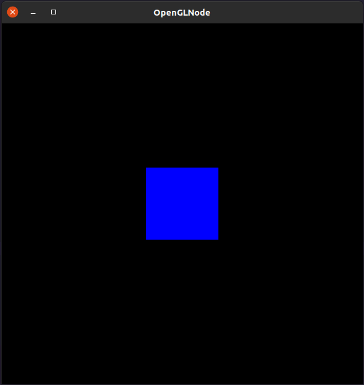

# NodeGL - OpenGL bindings for Node.JS

This project ports OpenGL C/C++ core calls to Node.JS using N-API.
All callable functions present on `gl.h` are binded, including
functions that depend on pointers or non-javascript sized variables
as float, short and bytes.
This was possible using the Buffer object of Node, that exports its
data as an pointer, not like an JS normal object nor JS arrays (with getters).

# Installing

> Warning: For now, the package cannot be downloaded because I'm disputing the 'nodegl' package name. Currently, this name is a reserved (squatted) package by another user. I already tried to contact the owner and submitted a dispute for NPM support review.
>
> When the dispute ends, I will publish this package for download on NPM, but in meanwhile you can download and build-it using the `build` script.
<!--
Using Npm:
```
npm install nodegl
```
Using Yarn:
```
yarn add nodegl
``` -->

# Usage

This package focuses on have only OpenGL bindings , nothing as GLUT or GLFW are included, so you
will need some context initializer for you. This example below uses a [GLFW port](https://github.com/Reon90/glfwJS) that appears on the ports list of the library's website.

```javascript
// Import Libs
const glfw = require("glfw-n-api");
const gl = require("nodegl");
// Setup Code
async function main() {
	// Init GLFW
	if (!glfw.glfwInit()) {
		glfw.glfwTerminate();
		process.exit(1);
	}
	// Define Constants
	const WINDOW_WIDTH = 600;
	const WINDOW_HEIGHT = 600;
	// Create Window
	const window = glfw.glfwCreateWindow(
		WINDOW_WIDTH,
		WINDOW_HEIGHT,
		"OpenGLNode",
		null,
		null
	);
	if (!window) {
		glfw.glfwTerminate();
		process.exit(1);
	}
	// Get Buffer Size
	glfw.glfwSetFramebufferSizeCallback(window, (window, fbW, fbH) => {
		gl.glViewport(0, 0, fbW, fbH);
		gl.glMatrixMode(gl.GL_PROJECTION);
		gl.glLoadIdentity();
	});
	// Set Current GL Context
	glfw.glfwMakeContextCurrent(window);
	// Pre Loop
	gl.glClearColor(0.0, 0.0, 0.0, 1.0);
	gl.glMatrixMode(gl.GL_PROJECTION);
	gl.glLoadIdentity();
	gl.glOrtho(-15.0, 15.0, -15.0, 15.0, -15.0, 15.0);
	// Main
	while (!glfw.glfwWindowShouldClose(window)) {
		// Check Window Events
		glfw.glfwPollEvents();
		// Clear the screen
		gl.glClear(gl.GL_COLOR_BUFFER_BIT);
		// Draw a blue square
		gl.glBegin(gl.GL_QUADS);
		gl.glColor3d(0.0, 0.0, 1.0);
		gl.glVertex3d(-3.0, -3.0, 0.0);
		gl.glVertex3d(3.0, -3.0, 0.0);
		gl.glVertex3d(3.0, 3.0, 0.0);
		gl.glVertex3d(-3.0, 3.0, 0.0);
		gl.glEnd();
		// Draw - End
		glfw.glfwSwapBuffers(window);
		gl.glFlush();
	}
	// Deallocate GLFW Context
	glfw.glfwTerminate();
	// Exit Program
	process.exit(0);
}
// Start
main();
```
As the result of running the code above we have this :


# License
This package is licensed under MIT License. You can see more about it [here](./LICENSE.md)
